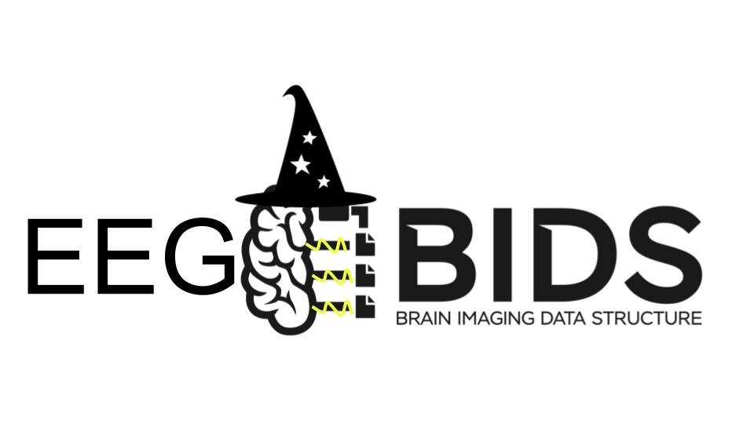

# EEG2BIDS Wizard

EEG2BIDS Wizard is a GUI for de-identifying EDF data and converting EEG or
iEEG recordings to BIDS. It can use LORIS credentials to retrieve metadata.
Remove saved credentials after using EEG2BIDS on a shared computer.

See the [user guide](docs/user-guide.md) for recording, metadata, annotation,
validation, and optional LORIS workflows.

## Project status

**Linux is the only supported development target.** The Python backend was
modernized in [#135](https://github.com/aces/EEG2BIDS/issues/135) (uv-managed
package) and the Electron/renderer toolchain in
[#137](https://github.com/aces/EEG2BIDS/issues/137) (Electron 43, Vite,
sandboxed renderer, safeStorage credentials, Electron-owned backend process).
Stabilizing the complete launch workflow is tracked in
[#136](https://github.com/aces/EEG2BIDS/issues/136).

Production packages, installers, and embedded Python artifacts are currently
**unsupported**. The former PyInstaller and Electron Builder paths have been
retired; no replacement packaging workflow exists yet. Windows and macOS
development support, automated tests, and CI are also explicitly deferred to
separate issues.

Frontend dependency versions are defined by `package.json` and
`package-lock.json`; the supported Node.js version by `.nvmrc` and the
`engines` field. The Python backend is defined solely by `pyproject.toml`
and `uv.lock`; these are the only authoritative Python dependency
definitions. See the [dependency inventory and audit guide](docs/dependencies.md)
for runtime/development classification and security-check commands.

## Backend (Python)

The backend is the first-party `eeg2bids` package. It is managed with
[uv](https://docs.astral.sh/uv/) and targets **Python 3.11+**. During
development, Electron launches it automatically (see Development below); to
run it manually:

```sh
uv sync --frozen          # create ./.venv and install the locked dependencies
uv run python -m eeg2bids # start the local Socket.IO service on 127.0.0.1:7301
```

`uv sync` creates a root `.venv`; there is no virtual environment inside the
package directory. Do not add a `requirements.txt` or install dependencies with
`pip` — change `pyproject.toml` and run `uv lock` instead.

The Socket.IO service runs on the standard-threading runtime (Werkzeug +
`simple-websocket`); the previous eventlet runtime has been removed.

## Development

See [docs/development.md](docs/development.md) for the full workflow:
debugging tools, logging, backend connection states, generating synthetic
development data, and the manual verification procedure.

### Requirements

- **Node.js 24** (declared in `.nvmrc`; anything satisfying the `engines`
  field, Node >= 22.12, works). With nvm: `nvm install`.
- **[uv](https://docs.astral.sh/uv/)** on `PATH` for the Python backend
  (uv resolves the required Python 3.11+ itself).
- A **secret service** — GNOME Keyring or KWallet — for secure LORIS
  credential storage. Without one the app still runs but warns that stored
  credentials are only obfuscated (see Credential storage below).

### Running

```sh
npm ci       # install frontend dependencies from the lockfile
npm run dev  # renderer (Vite on port 3000) + Electron + Python backend
```

`npm run dev` is the single top-level development command (`npm start` is an
alias). It runs the Vite dev server and Electron together; when either side
exits — including Ctrl+C — the other is shut down with it, so no dev server
is left behind. Electron owns the backend process: it launches
`uv run --frozen python -m eeg2bids`, captures its output into the terminal
with a `[backend]` prefix, reports availability to the renderer, and
terminates the whole process group on shutdown so no Python process is left
behind. If something already listens on `127.0.0.1:7301` — for example a
manually started backend — Electron uses the existing service instead of
starting its own.

The pieces also run separately:

```sh
npm run dev:renderer       # Vite dev server only (http://localhost:3000)
npm run electron-start     # Electron only (expects the dev server)
npm run build              # renderer production build into build/
npm run lint               # ESLint over src/ and electron/
uv run python -m eeg2bids  # backend only (127.0.0.1:7301)
```

Chromium DevTools open automatically in development, and Vite provides hot
module replacement and renderer source maps.

### Source layout

- `src/` — the React renderer (Vite root: `index.html` + `src/index.jsx`)
- `electron/main/` — the Electron main process, split by concern: lifecycle
  (`index.js`), window creation (`windows.js`), IPC registration (`ipc.js`),
  credential and settings persistence, backend process ownership
  (`backend-service.js`), and the external-link allowlist
- `electron/preload/` — the `window.eeg2bids` context bridge, the only
  renderer/main interface: fixed IPC channels, serializable values, no
  Electron objects exposed to the renderer
- `public/` — static assets copied verbatim into the build
- `eeg2bids/` — the Python backend package

### Credential storage

LORIS credentials are encrypted with Electron `safeStorage` and persisted
under the application `userData` directory (`~/.config/eeg2bids/`), separate
from ordinary settings such as the LORIS URL. On Linux, secure encryption
requires a secret service (GNOME Keyring or KWallet). When only the
`basic_text` fallback is available, the app logs an explicit warning that
credentials are obfuscated rather than encrypted; when no backend exists at
all, it refuses to store them. Credentials saved by older keytar-based
builds are not migrated — sign in again.

### Troubleshooting: Chromium sandbox errors on launch

Ubuntu 24.04+ restricts unprivileged user namespaces, so Electron can abort
at startup with `The SUID sandbox helper binary was found, but is not
configured correctly`. Either grant the setuid bit (must be redone after
every Electron install or upgrade):

```sh
sudo chown root:root node_modules/electron/dist/chrome-sandbox
sudo chmod 4755 node_modules/electron/dist/chrome-sandbox
```

or install a persistent AppArmor profile that survives reinstalls (adjust
the checkout path):

```sh
sudo tee /etc/apparmor.d/electron-eeg2bids <<'EOF'
abi <abi/4.0>,
include <tunables/global>

profile electron-eeg2bids /path/to/EEG2BIDS/node_modules/electron/dist/electron flags=(unconfined) {
  userns,
}
EOF
sudo apparmor_parser -r /etc/apparmor.d/electron-eeg2bids
```

Do not work around it with `--no-sandbox`.

## Packaging

Production packages, installers, and embedded Python artifacts remain
**unsupported** in this branch. The former PyInstaller and Electron Builder
paths have been retired and are not restored here; a replacement is tracked
separately in #136. The backend is structured to keep that door open: it is a
normal importable package with a single entry point (`python -m eeg2bids`,
also exposed as the `eeg2bids` console script), and PyInstaller is declared as
an optional `packaging` dependency group (`uv sync --group packaging`) so a
future freeze step is not blocked.
