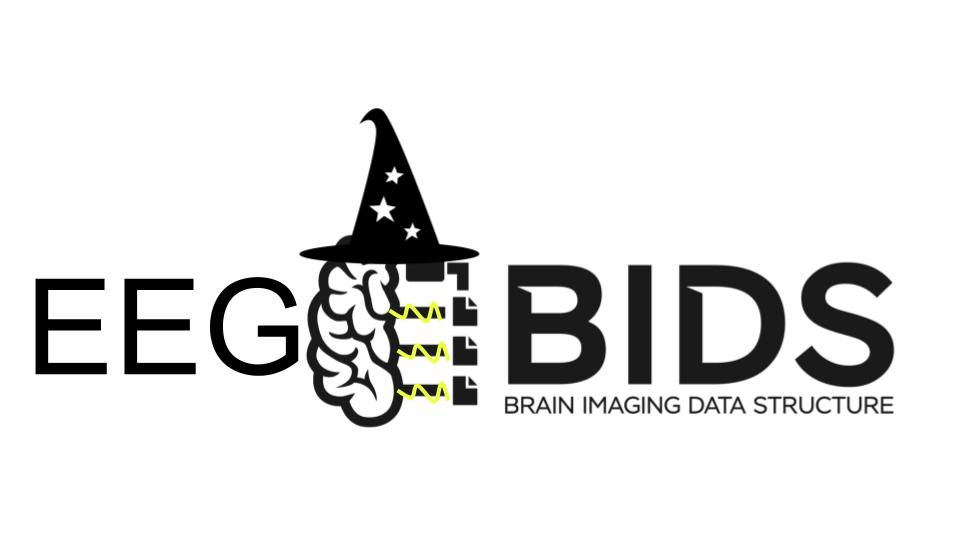

# EEG2BIDS Wizard

EEG2BIDS Wizard is a GUI for converting continuous EEG and iEEG recordings to
BIDS. Recordings are opened through MNE-Python's `mne.io.read_raw()`, so any
continuous format MNE can read may work; **EDF and continuous EEGLAB SET**
(embedded-data `.set` and `.set`/`.fdt` pairs) are the verified formats. It can
also de-identify EDF headers and use LORIS credentials to retrieve metadata.
Remove saved credentials after using EEG2BIDS on a shared computer.

See the [user guide](docs/user-guide.md) for supported formats, recording,
metadata, events, validation, and optional LORIS workflows.

## Project status

**Linux is the supported development target. Production packages are supported
for Ubuntu and Windows 11 x64.** The Python backend was modernized in
[#135](https://github.com/aces/EEG2BIDS/issues/135) (uv-managed package) and the
Electron/renderer toolchain in
[#137](https://github.com/aces/EEG2BIDS/issues/137) (Electron 43, Vite,
sandboxed renderer, safeStorage credentials, Electron-owned backend process).

A supported Linux production build landed in
[#170](https://github.com/aces/EEG2BIDS/issues/170): a `.deb` that bundles the
Electron app and the PyInstaller-frozen Python backend, with Chromium sandbox
integration for Ubuntu 24.04+. See [Packaging](#packaging) to build it and the
[installation guide](docs/installation.md) to install it. A Windows 11 x64 NSIS
build landed in [#188](https://github.com/aces/EEG2BIDS/issues/188), including a
frozen backend, Windows process lifecycle support, and native CI smoke testing.
See the [Windows packaging guide](docs/windows-packaging.md). macOS packaging is
tracked in [#189](https://github.com/aces/EEG2BIDS/issues/189), and coordinated
release automation in [#190](https://github.com/aces/EEG2BIDS/issues/190).

Automated backend and Electron integration suites are available for the
supported Linux environment; see the [testing guide](docs/testing.md).

Frontend dependency versions are defined by `package.json` and
`package-lock.json`; the supported Node.js version by `.nvmrc` and the
`engines` field. The Python backend is defined solely by `pyproject.toml`
and `uv.lock`; these are the only authoritative Python dependency
definitions. See the [dependency inventory and audit guide](docs/dependencies.md)
for runtime/development classification and security-check commands.

## Backend (Python)

The backend is the first-party `eeg2bids` package. It is managed with
[uv](https://docs.astral.sh/uv/) and targets **Python 3.11+**. During
development, Electron launches it automatically (see Development below); to
run it manually:

```sh
uv sync --frozen          # create ./.venv and install the locked dependencies
uv run python -m eeg2bids # start the local Socket.IO service on 127.0.0.1:7301
```

`uv sync` creates a root `.venv`; there is no virtual environment inside the
package directory. Do not add a `requirements.txt` or install dependencies with
`pip` — change `pyproject.toml` and run `uv lock` instead.

The Socket.IO service runs on the standard-threading runtime (Werkzeug +
`simple-websocket`); the previous eventlet runtime has been removed.

## Development

See [docs/development.md](docs/development.md) for the full workflow:
debugging tools, logging, backend connection states, generating synthetic
development data, and the manual verification procedure.

### Requirements

- **Node.js 24** (declared in `.nvmrc`; anything satisfying the `engines`
  field, Node >= 22.12, works). With nvm: `nvm install`.
- **[uv](https://docs.astral.sh/uv/)** on `PATH` for the Python backend
  (uv resolves the required Python 3.11+ itself).
- A **secret service** — GNOME Keyring or KWallet — for secure LORIS
  credential storage. Without one the app still runs but warns that stored
  credentials are only obfuscated (see Credential storage below).

### Running

```sh
npm ci       # install frontend dependencies from the lockfile
npm run dev  # renderer (Vite on port 3000) + Electron + Python backend
```

`npm run dev` is the single top-level development command (`npm start` is an
alias). It runs the Vite dev server and Electron together; when either side
exits — including Ctrl+C — the other is shut down with it, so no dev server
is left behind. Electron owns the backend process: it launches
`uv run --frozen python -m eeg2bids`, captures its output into the terminal
with a `[backend]` prefix, reports availability to the renderer, and
terminates the whole process group on shutdown so no Python process is left
behind. If something already listens on `127.0.0.1:7301` — for example a
manually started backend — Electron uses the existing service instead of
starting its own.

The pieces also run separately:

```sh
npm run dev:renderer       # Vite dev server only (http://localhost:3000)
npm run electron-start     # Electron only (expects the dev server)
npm run build              # renderer production build into build/
npm run lint               # ESLint over src/ and electron/
uv run python -m eeg2bids  # backend only (127.0.0.1:7301)
```

Chromium DevTools open automatically in development, and Vite provides hot
module replacement and renderer source maps.

### Testing

See [docs/testing.md](docs/testing.md) for test dependencies, fixture policy,
troubleshooting, and guidance on which suites a change requires. The complete
automated suites run with:

```sh
uv run pytest
npm run test:electron
```

On headless Linux, run the Electron suite with
`xvfb-run -a npm run test:electron`.

### Source layout

- `src/` — the React renderer (Vite root: `index.html` + `src/index.jsx`)
- `electron/main/` — the Electron main process, split by concern: lifecycle
  (`index.js`), window creation (`windows.js`), IPC registration (`ipc.js`),
  credential and settings persistence, backend process ownership
  (`backend-service.js`), and the external-link allowlist
- `electron/preload/` — the `window.eeg2bids` context bridge, the only
  renderer/main interface: fixed IPC channels, serializable values, no
  Electron objects exposed to the renderer
- `public/` — static assets copied verbatim into the build
- `eeg2bids/` — the Python backend package

### Credential storage

LORIS credentials are encrypted with Electron `safeStorage` and persisted
under the application `userData` directory (`~/.config/eeg2bids/` on Linux,
`%APPDATA%\eeg2bids\` on Windows), separate from ordinary settings such as the
LORIS URL. On Linux, secure encryption
requires a secret service (GNOME Keyring or KWallet). When only the
`basic_text` fallback is available, the app logs an explicit warning that
credentials are obfuscated rather than encrypted; when no backend exists at
all, it refuses to store them. Credentials saved by older keytar-based
builds are not migrated — sign in again.

### Troubleshooting: Chromium sandbox errors on launch

Ubuntu 24.04+ restricts unprivileged user namespaces, so Electron can abort
at startup with `The SUID sandbox helper binary was found, but is not
configured correctly`. Either grant the setuid bit (must be redone after
every Electron install or upgrade):

```sh
sudo chown root:root node_modules/electron/dist/chrome-sandbox
sudo chmod 4755 node_modules/electron/dist/chrome-sandbox
```

or install a persistent AppArmor profile that survives reinstalls (adjust
the checkout path):

```sh
sudo tee /etc/apparmor.d/electron-eeg2bids <<'EOF'
abi <abi/4.0>,
include <tunables/global>

profile electron-eeg2bids /path/to/EEG2BIDS/node_modules/electron/dist/electron flags=(unconfined) {
  userns,
}
EOF
sudo apparmor_parser -r /etc/apparmor.d/electron-eeg2bids
```

Do not work around it with `--no-sandbox`.

## Packaging

Supported production packages bundle the Electron app, renderer, and
PyInstaller-frozen Python backend, so end users need neither Node, npm, uv, nor
a Python interpreter:

- Ubuntu amd64: `.deb`
- Windows 11 x64: unsigned, per-user NSIS installer

Build natively from the authoritative lockfiles:

```sh
npm run dist:linux     # on Linux: .deb
npm run dist:windows   # on Windows: x64 NSIS installer
```

Artifacts are written to `dist/electron/`. PyInstaller must run on the target
operating system; the Windows backend cannot be cross-compiled from Linux. The
freeze step alone is `npm run freeze:backend`, using
`tools/eeg2bids-backend.spec` and the locked `packaging` dependency group.

The `Package` GitHub Actions workflow builds both platforms natively, smoke
tests the installed Windows application and managed backend, generates
platform-specific SHA-256 files, and uploads workflow artifacts. Immutable RC
tags invoke that workflow and publish a GitHub prerelease for manual QA; see the
[release-candidate guide](docs/releasing.md). Final promotion remains a separate,
protected manual operation.

See the [installation guide](docs/installation.md), the
[Windows packaging guide](docs/windows-packaging.md), and the historical
[Linux packaging design](docs/linux-packaging-design.md). macOS is not yet
supported (#189).
