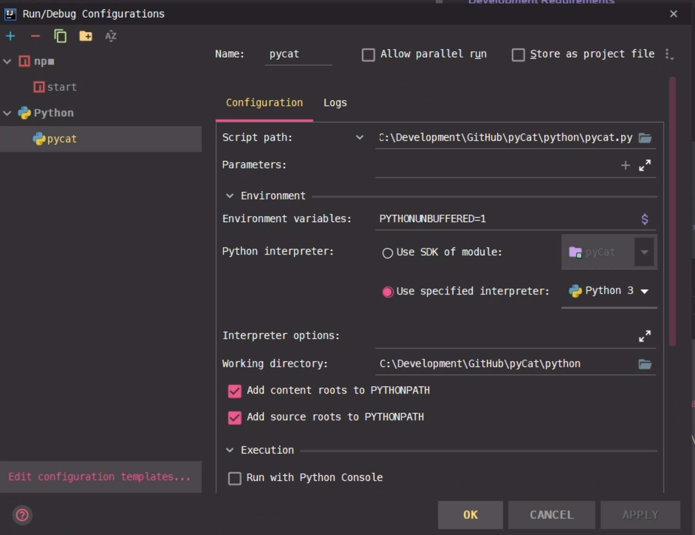
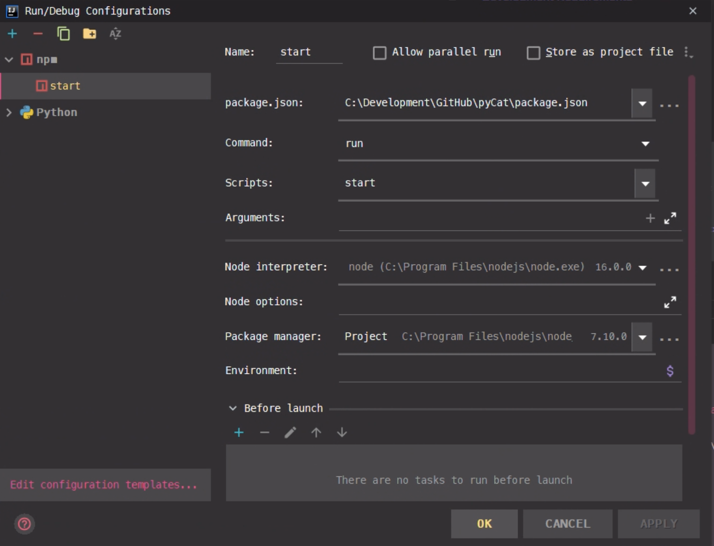
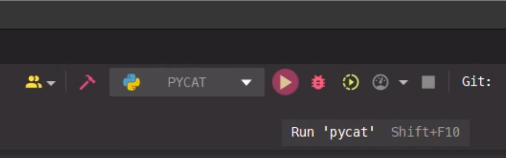
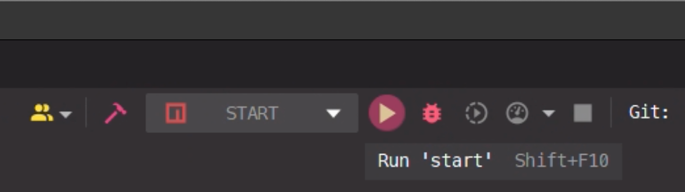

["Click Here" to return to the Windows README.md](../README.md)

# IntelliJ IDEA Ultimate Guide for Windows

## Development tools

#### Downloads:

* [IntelliJ IDEA Ultimate](https://www.jetbrains.com/idea/) Used for both Javascript and Python (see plugins)
* [Python - plugin for IntelliJ IDEA](https://plugins.jetbrains.com/plugin/631-python)
* [Node.js - plugin for Intellij IDEA](https://plugins.jetbrains.com/plugin/6098-node-js)

Alternative IDE Downloads:

* [WebStorm IDE](https://www.jetbrains.com/webstorm/) Used for JavaScript
* [PyCharm IDE](https://www.jetbrains.com/pycharm/) Used for Python

#### Instructions for IntelliJ IDEA:

1) Inside IntelliJ IDEA Ultimate open the "Select Run/Debug Configuration" dropdown
2) Click the "Add New Configuration" and select Python
3) Set "Script path" to python\set2bids.py
4) Set "Python interpreter" to Python 3.8.5 that you've already installed.
5) See the image below for an example:

6) Inside IntelliJ open the "Select Run/Debug Configuration" menu 
7) Click the "Add New Configuration" and select npm
8) Set "Scripts" to start
9) See the image below for an example:

10) Make sure to "APPLY" your changes and click "OK"
11) Now launch debug mode of python "SET2BIDS Wizard" (see image below) 

12) Now launch debug mode of npm "START" (see image below)

